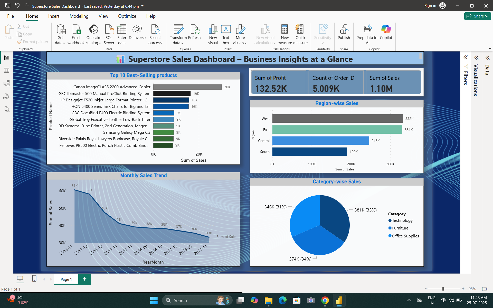

# 📊 Business Sales Dashboard - E-commerce Data

An interactive Power BI dashboard project to analyze and visualize real-world e-commerce data for business insights.

## 🔍 About the Task

**Task:** Analyze e-commerce data to identify best-selling products, sales trends, and high-revenue categories using Power BI.

**Skills Gained:**
- Data Cleaning
- DAX Calculations
- Trend & Category Analysis
- Business Storytelling with Visuals

**Deliverable:**
An interactive Power BI dashboard with charts, metrics, and filters to support business decision-making.

## 🗂️ Project Files

```
├── Superstore Sales Dashboard.pbix   # Power BI report file
├── superstore_sales_dataset.xls      # E-commerce data (optional)
├── README.md                         # Project overview and documentation
└── dashboard_preview.png             # Screenshot of the dashboard
```

## 🚀 How to Use

1. **Clone the Repository:**
```bash
git clone https://github.com/your-username/business-sales-dashboard.git
cd business-sales-dashboard
```

2. **Open the Power BI File:**
- Launch Power BI Desktop
- Open `Ecommerce_Sales_Dashboard.pbix`

3. **Interact with the Dashboard:**
- Filter by category, region, or date
- Hover to view sales & profit metrics
- Use slicers and drill-down visuals

4. **Customize:**
- Replace the dataset with your own
- Modify visuals or add new ones using DAX

## 🔑 Key Insights Visualized

- 📈 **Sales Trend Over Time**
- 🛒 **Top Products by Revenue & Quantity**
- 💰 **Category-Wise Profitability**
- 🌍 **Sales by Region**
- 🎯 **Interactive Filters & Slicers**

## 🖼️ Dashboard Preview



## 📚 References

- [Microsoft Power BI Documentation](https://learn.microsoft.com/power-bi/)
- [DAX Guide](https://dax.guide/)

---

🧑‍💻 Developed by **Samar Manna**  
🎓 B.Tech in Computer Science & Engineering (Data Science)

---

## 📄 License

Licensed under the [MIT License](LICENSE). Feel free to use and modify.
